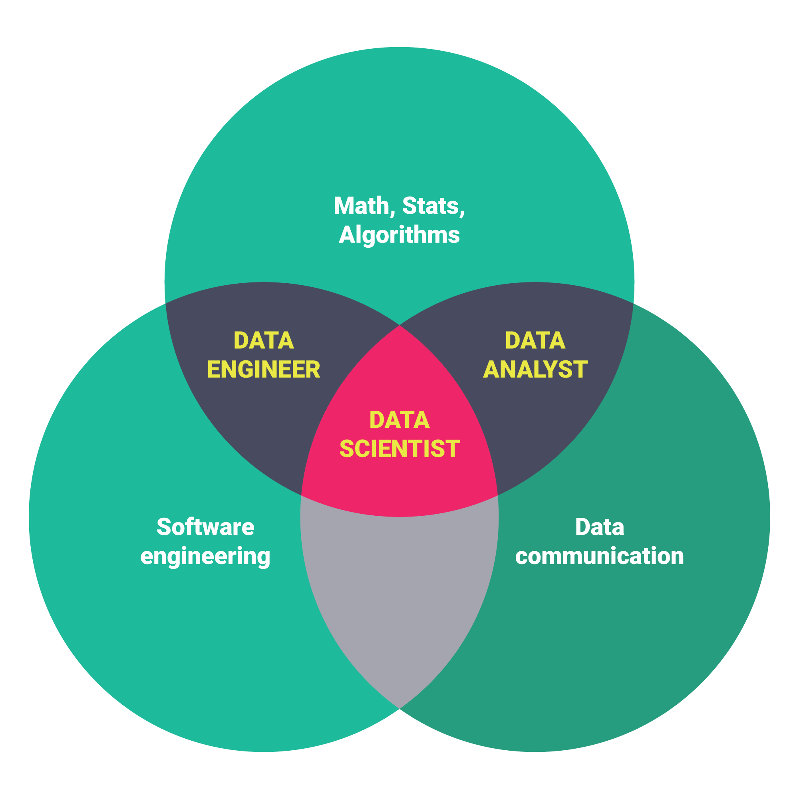

```{r setup, include=FALSE}
knitr::opts_chunk$set(echo = FALSE, message = F, warning = F, cache = T)
library(knitr)
library(tidyverse)
library(magrittr)
library(arm)
```

## Tonight's agenda
- What is this course about?
- Who should take this course?
- Course elements.
- Why study data science? 
- Introductions.
- Conceptual framework for the course
- Class 1 script: Set up RStudio and get started with R


# What is this course about?

## Course topics

- **This is a graduate level course in applied statistics and business analytics using R**.
- We will be taking a deep dive into linear and logistic regression modelling. 
- For comparison we will also study some machine learning approaches to regression and classification tasks. 
- You will learn how to: 
    + Explore data.
    + Fit, assess, improve and interpret models.
    + Deal with real world data (missing values, outliers, messy structures).
    + Communicate your results to non-experts as solutions to business problems.
- You will gain experience taking an analysis from raw data to finished product, and along the way will learn to use efficient workflows and make your research reproducible.


## Regression example

- Why study  regression?  
- Linear and logistic regression models work well for both description and prediction, and computationally they are fast, allowing the analyst to learn quickly from the data.
- With these models we can:
    + precisely **describe** the relationships between variables in a data sample (and assess whether those relationships are artifacts of chance).
    + create a model to **predict** unknown  values of the outcome variable given known inputs.
- Regression models are easy to fit and extremely powerful.  Yet even for experts complicated models *are easy to misuse and misinterpret*.

## Business problem

- A classic *business problem* is customer churn.
- Companies would like to retain existing customers since it is more profitable to keep a customer than to find a new one. 
- We can use a classification model to identify customers  who are likely to churn when their contracts expire. 
- Of course, we also need to ask what we would do with that knowledge:  Should we offer an incentive to re-enroll? If so, how much and who should get it? 
- These are important questions.  We'll set them aside for now to focus on the *analytical problem* of identifying customers likely to churn. 

## Telcom dataset (first six rows, selected columns)


```{r}
churn <- read.csv("churn.csv")

knitr::kable(head(churn[,c(2,3, 5, 6, 21)]))

```


## Let's create a simple model of  churn


```{r message=F, warning=F}
library(arm)
display(glm(Churn ~ gender + SeniorCitizen + tenure , family = binomial, data= churn))

```

## Questions


- What do these coefficients mean exactly? How would we translate them  into  meaningful quantities for a client with no background in statistics?
- Is this a good model?  If we wanted to make it better, which variables should be added or removed?
- How would we know if adding or removing variables improved the model?


## Questions


- Should any of these variables be transformed or should any outlying observations be removed from the dataset?  
- Should we add interactions between variables?
- Does this model violate any of the mathematical assumptions  of  logistic regression?

## Questions


- **Using modern statistical software to fit models is easy, but understanding, validating, improving and communicating your results can be a challenge.**
- This course will equip you for that challenge.

# Who should take this course?

## Preparation

- This course is designed for Business graduate students interested in a  data science career who have:
    - *some knowledge of statistics* (taken 1 or 2 classes).
    - *some experience programming in R*.
- Ideally, students will have taken "Introduction to Business Analytics" during the first 5 weeks of the term. 
- Some preparation is essential since students with little (or barely remembered) statistics knowledge, or who have no R programmming experience, tend to struggle.
- If your statistics and/or programming skills are weak then consider doing some preparatory course work and delaying this course.  Your learning experience will be vastly better.

# Course elements

## Main course texts

- **Datacamp.** Students have free access to all of the content at Datacamp through the end of the semester. (Email me if you have not received an invitation to the IS 6489 group at Datacamp or experience problems with your account.) 

- James, G., Witten, D., Hastie, T., and Tibshirani, R. (2013). **An introduction to statistical learning**. Springer. This is the main textbook for the course. It is available to download for free at the above link (look in the upper right corner of the page:  "Download the book PDF"). The print book is available from Amazon.

<!-- ## Supplementary course texts -->

<!-- - Gelman, A., and Hill, J. (2007). **Data analysis using regression/hierarchical models**. Cambridge: Cambridge UP. Several chapters from this book will be posted on Canvas as a supplementary resource. -->
<!-- - Webb, J. (2017). **Course Notes for IS-6489, Statistics and Predictive**. The notes cover the course material in a lot of detail, with many specific code examples. -->

## Course schedule

- Thursdays, 6 - 10 PM, during semester terms II and III.
- However,  this will be a hybrid course, with some lecture material available online, to be watched before class.  Our nightly schedule will usually go from 6 - 9 PM or so. 
- We'll plan to take a break at about 7:15 PM.

## Homework

- **Video lectures.**  You should plan to watch the weekly videos before class.  For example, week 2 lecture videos and slides should be watched *before* week 2.
- **Readings.**  Weekly readings from *An introduction to statistical learning* should be completed before class. This is a tough book but worth struggling with.
- **Labs.** There will be weekly labs consisting in questions embedded in interactive R notebooks. 
- **Weekly quizzes.** To ensure that you have understood the material in the labs, there will be short weekly quizzes covering the same material. 

## Project

- The final project will consist in a prediction competition that will require you to practice the skills you learned in the class.
- You can choose to work in a group no larger than three or, if you prefer, by yourself. (It is an advantage to work in a group.)
- If you want to work by yourself or want to form a group of your choice then please sign yourself up by the third week of the class (look for the "form project groups" assignment). Otherwise, students who remain unassigned after the third class meeting will be randomly placed into a project group.
- There will be an interim report due midway through the semester to ensure that you're making progress on the project, and a final report due a week after the last class.

## Methods of instruction

- Class sessions will be a mix of review lecture and practice. I will rehearse concepts and tools from the lecture videos and then we will practice live coding or work through and discuss data analysis problems and exercises. 
- I like to teach interactively, so please do not hesitate to ask questions during the class! 
- You should expect to work in small groups occasionally and to present your findings to the class.  
- I will also occasionally cold call on students for answers to problems and questions.   
- Slides will be available prior to class for download, if you want to follow along on your own computer.
- The script created during live coding will be posted to Canvas afterwards for your reference.

<!-- ## Learning R  -->

<!-- - If you have never done any programming, learning R can be a challenge.  -->
<!-- - Be tenacious in puzzling through the examples in class and use the tutorials at Datacamp.  You will pick it up quickly.  -->
<!-- - Make use of my office hours and the TA's study sessions. -->

# Data Science

## Why data science? Free and ubiquitous data.

"The ability to take data --- to be able to understand it, to process it, to extract value from it, to visualize it, to communicate--- will be a hugely important skill in the next decades, because now we really do have essentially free and ubiquitous data. So the complimentary scarce factor is the ability to understand that data and extract value from it. **I keep saying the sexy job in the next ten years will be statisticians**."

Hal Varian, Google Chief Economist and UC Berkeley Professor, *The McKinsey Quarterly*, January 2009


## Why data science? A trend of more and more data.
From 2011:

"By 2018, the United States alone could face a shortage of 140,000 to 190,000 people with deep analytical skills as well as 1.5 million managers and analysts with the know-how to use the analysis of big data to make effective decisions."

Mckinsey & Company, *Big data: The next frontier for innovation, competition, and productivity* (2011).

## Why data science? Shortage of talent.

From LinkedIn, May 2018:


## Why data science? Interesting work.


## What is a data scientist?

Data scientists extract, visualize and communicate insights from data.  They are skilled at statistics, programming and telling stories.



## Data science for business

- This course is similar to---but also importantly different from---a data science course you might take in the Math or CS department.
- You will learn analytical methods in this course but our focus will be on *application*: how to use the methods *to solve business problems.*
- After fitting a model, we will consider how our  results support decision-making in a particular business context. 
- Example from the earlier churn model:
    1. Predict the probability of customer churn.
    2. Recommend an incentive program based on your analysis of the cost of the program compared to the benefit of retaining customers.
    3. Make a case for your recommendation with compelling visualizations and clear explanations.


## Why R?

- R is an open-source, object-oriented programming language that was invented to do statistics and is widely used.
- Solutions to coding problems abound on the web.
- Cutting edge techniques are immediately available as packages (long before they are incorporated into commercial software).
- Makes collaboration and peer review easy (if your colleagues are using R).
- RStudio!
- The tidyverse collection of packages:  dplyr, ggplot2, tidyr ....

# Introductions

## Data scientists have interesting career paths!

- I once worked in a venture capital firm with these employees:
    + Math PhD
    + Physics undergrad (no degree)
    + PhD in Ancient Semitic Languages
    + English PhD (me)
    + Computer Science MS
    + Wildlife Biology MS, who had formerly managed data science at Ebay
    + Econ PhD
    
## Me

- BA in Philosophy, PhD in American Literature.
- First academic job at the National University of Singapore in an Honors College.
- Became interested in statistics while doing educational assessment for a program for first year students at the University of Utah.
- Got hired as a statistical researcher just before finishing my MS in Statistics.  (Never went back.)
- My last industry job was directing the data science team at Salt Lake Community College.

## You

- Form groups of 2 or 3 with those sitting near you.
- Introduce yourselves and have a conversation for 5 or 10 minutes:
    + Where are you from?
    + What is your educational and professional background?
    + Why are you interested in studying analytics?
    


# Conceptual Framework for the Course

## Statistical learning

From *An Introduction to Statistical Learning*:

"Statistical learning refers to a vast set of tools for understanding data.  These tools can be classified as supervised or unsupervised. Broadly speaking, supervised statistical learning involves building a statistical model for predicting, or estimating, an output based on one or more inputs....  With unsupervised statistical learning there are inputs but no outputs; nevertheless we can learn relationships and structure from such data." (1)

## Conceptual framework

We will introduce the conceptual framework for the course by making some key distinctions:

- Supervised learning vs. unsupervised learning
- Regression vs. classification
- Prediction vs. description

## Example dataset:  mtcars (first six rows)


```{r}
data(mtcars)
knitr::kable(head(mtcars[,c("mpg","cyl","hp","wt")]))

```

## Supervised learning

- We can use the `mtcars` dataset to fit a simple linear regression model:  `mpg ~ cyl + hp + wt`.
- The tilde in this formula means "explained by" or "modeled by."
- Each row in the dataset (or *observation*) represents multiple pieces of information on kinds of cars from the 1970s.
- In this case, `mpg` is the *outcome variable* (also known as the dependent, target or response variable).
- `cyl`, `hp` and `wt` are the *predictors* (also known as independent variables, inputs, features or fields).
- The goal in supervised learning is to use the recorded relationships between the predictors and the outcome to develop (or "learn") a model that can be used for prediction or description.

## Unsupervised learning

- Imagine that all we have in the `mtcars` dataset is the `mpg` variable.
- Can we cluster observations by putting cars with similar `mpg` into groups?
- In this case there is no supervision, no previously observed groupings we can rely on to guide us in assigning a group to a new observation.
- Instead, the learning is *unsupervised*: we do the best we can, using  algorithms like k-means clustering or hierarchical clustering, to find structure/patterns in the data.
- In this course we consider only *supervised learning*.  

## Regression vs. classification

- There are two main types of supervised learning: regression and classification.
- In *regression problems* the outcome is unbounded and continuous:  `r round(rnorm(10), 2)`.... 
- For regression we will use linear regression and K-nearest neighbors (KNN) regression.
- In *classification problems* the outcome is binary and the goal is to learn a model of class membership denoted by categopries such as 0/1 or no/yes or passed/failed.
- For classification we will use logistic regression, KNN classification and support vector machines.

## Prediction vs. description

- Machine learning algorithms like KNN and SVM work well for prediction. 
- But they don't work that well for description because the model is hidden:  they are "black box" algorithms providing little interpretable information about the relationship between predictors and outcome.
- By contrast, linear and logistic regression work well for both prediction and description. 
- These models learn an equation that can be used not only to predict unknown outcomes but also to describe relationships between the predictors and a known outcome.
- An example....

## Prediction

```{r}
ds <- mtcars[1:9,c("mpg","wt")]
ds$mpg[7:9] <- "?"
knitr::kable(ds)

```

- *Predictive goal*:  Learn a model that will fill in the missing outcome values.

 
## Description

```{r}
knitr::kable(ds)
```

- *Descriptive goal*:  Learn a model that will describe the relationship between mpg and wt.

## Model of mpg

```{r, echo=FALSE}
#lm(mpg ~ wt, data= mtcars)
library(ggplot2)
ggplot(mtcars, aes(wt, mpg)) + 
  geom_point() +
  theme_minimal() +
  stat_smooth(method="lm", se = F)+
  geom_text(label="Model: mpg = 37.29 - 5.34 * wt", x= 4, y= 30, size = 8)

```

- **Description**: wt increases by 1, mpg declines by 5.34.
- **Prediction**: when wt = 4.5, mpg = 37.29 - 5.34 * 4.5.