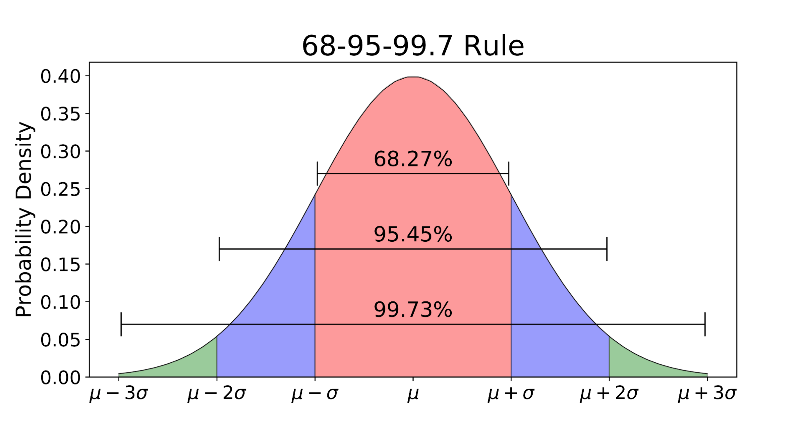

```{r setup, include=FALSE}
knitr::opts_chunk$set(echo = TRUE, message = F, warning = F)
library(knitr)
library(tidyverse)
library(magrittr)
library(arm)
```

## Agenda

- Announcements / Questions
- Review: Statistical inference
- Practice:  
    + EDA
    + Statistical inference
    + Communication

#  Announcements / Questions

##  Announcements / Questions

- Note that there is a video this week on the final project. 
    + Review the video as well as the assignment description and the Kaggle website, and form groups (no larger than 3).
    + I believe it is an advantage to be in a group (based on what I've seen in the past), as the modeling problem is fairly challenging. 
    + Students who are not in groups after tonight will be randomly assigned to a group
- Additional courses at Datacamp?  I can't emphasize enough the importance pursing learning on your own.  Next steps:  the advanced courses on dplyr and ggplot2. 
- Questions on the material or the course for this week?

#  Statistical inference review and practice

##  Statistical inference example

- Suppose that you work as an analyst at a marketing firm and you've been asked to use analytics to determine which of two ads on a website, A or B, is more effective.
- "More effective" in this case means:  generating more clicks.
- You decide to run an experiment---an A/B test---in which you randomly pick visitors to the website to see ad A or B.
- The data that is generated consists in hourly totals that are then summarized as a daily measure: average hourly clicks.
- You run the experiment for 30 days.

##  Statistical inference example

- The data you get back from IT (top six rows) looks like this:

```{r, echo = F}
set.seed(127)
df <- data.frame(Day = 1:30,
                 A = round(rnorm(30, mean = 300, sd = 105), 2),
                 B = c(98.83, rep(NA, 29)))

kable(df[1:6,])

```

- Yikes! There has obviously been a problem with data collection. You have only one observation for the B ad in the entire dataset!
- Your professional life flashes before your eyes....

##  Statistical inference example
Take a closer look at the data:

```{r echo = F}
summary(df)
```


##  Statistical inference example

Plot the observations.

```{r echo = F}
ggplot(df, aes(A)) +
  geom_density() +
  geom_vline(xintercept = 98.83, col= 2, lty = 2) +
  labs(title = "Results from the A/B test") +
  theme_minimal()  +
  annotate("text", label ="<--- Single B observation", x =160, y = .003)
```


##  Statistical inference example

- **Questions**: 
    + Why do you need to randomize users into either the A or B group?  
    + Why does the density plot of the A observations have the shape it does?
    + The A observations are a *sampling distribution*:  T or F?
    + How would you summarize the A observations statistically?
    + Are the A observations a sample or a population: Y or N?
    + Is your analysis salvageable?

- Have at it:  PollEv.com/jeffwebb768    

## Statistical inference review

- Statistical inference refers to the science of using information from samples--- $\bar{x}$ or $\hat\beta$ or any other sample statistic---to **infer** (make educated guesses about) population  parameters ($\mu$, $\beta$).
- Usually we are interested in comparing two groups or assessing the relationship  between two variables, and want to know whether the sample statistic---the observed difference or relationship--- is real or is due to chance.
- "is real" means: is true or actual, exists in the population.
- The problem is that samples vary and any sample statistic gives uncertain information about the population.
- Both p-values and confidence intervals (CIs) are tools for judging whether an observed difference or relationship is real.


##  Samples and populations

Bernoulli distribution (e.g., a single coin flip):  $\mu= p$; $\sigma^2$ = $p(1-p)$

```{r}

rbinom(n = 10, size = 1, prob = .5)
rbinom(n = 10, size = 1, prob = .5)
rbinom(n = 10, size = 1, prob = .5)

```

##  Sampling distribution

If we summarize each sample by taking the mean, those summary statistics---the means---is known as a **sampling  distribution**, specifically the **sampling distribution of the sample mean**.

```{r echo = F, results = 'markup'}
data.frame(sample = 1:10,
           n = 10,
           mean = replicate(10, mean(rbinom(10, 1, .5)))) %>%
  kable

```

##  Sampling distribution

Why does the distribution of sample means look normal when the underlying distribution is binary?

```{r echo = F}
sample_means <- data.frame(sample = 1:10,
                           means = replicate(10, mean(rbinom(n = 10, size = 1, prob = .5))))
ggplot(sample_means, aes(means)) +
  geom_histogram() +
  theme_minimal() +
  labs(title = "Sampling distribution of 10 sample means")

```


##  Sampling distribution

Why does the distribution of sample means look normal when the underlying distribution is binary?

```{r echo = F}
sample_means <- data.frame(sample = 1:30,
                           means = replicate(30, mean(rbinom(n = 10, size = 1, prob = .5))))
ggplot(sample_means, aes(means)) +
  geom_histogram() +
  theme_minimal() +
  labs(title = "Sampling distribution of 30 sample means")

```

##  Sampling distribution

Why does the distribution of sample means look normal when the underlying distribution is binary?

```{r echo = F}
sample_means <- data.frame(sample = 1:100,
                           means = replicate(100, mean(rbinom(n = 10, size = 1, prob = .5))))
ggplot(sample_means, aes(means)) +
  geom_histogram() +
  theme_minimal() +
  labs(title = "Sampling distribution of 100 sample means")

```

## Central limit theorem

- When independent random variables are added together (or averaged or subtracted) the result is a normal distribution. 
- So, if n is large enough, sampling distributions are normal.
- Why do we care?
- Well, it's a cool fact, but also...
- The normal distribution has convenient properties for doing inference, specifically: 95% of the observations are within $\pm$ 2 standard deviations of the mean.


## Normal distribution



##  Standard error

- A standard error (SE) is just the standard deviation of a sampling distribution. 
- We can use it to  represent uncertainty, indicating how much a sample statistic is expected to fluctuate with repeated sampling. 
- The larger an SE, the more fluctuation across samples,  and the greater the uncertainty we have about how close the sample statistic is to the population parameter.
- We rarely have sampling distributions so we must estimate the SE from a single sample.
- In the case of the standard error of the mean (SEM) the formula is: $\frac{s}{\sqrt{n}}$.
- Would the SEM be larger or smaller if the sample size was larger?

##  Back to the A/B test...

```{r echo = F, results='markup'}
kable(df[1:10, ], rownames= NULL)
 
```


##  Back to the A/B test...

- Is the analysis salvageable? Well,
    + Each observation is a sample statistic:  a daily average of  hourly clicks.
    + As an average, the distribution of the A observations, because of the CLT, will be normal.  (It may not look quite normal but that is only because n = 30.)
    + We can exploit the theoretical properties of the normal distribution to assess how rare the one observation from the B group would be if it was from the same population as A.
- We can use a hypothesis test....    
    
## Null hypothesis significance testing or NHST

- In frequentist statistics we use NHST to make inferences about  differences between samples or relationships between variables.
    + Basically, proof by contradiction: assume no difference/relationship, then attempt to disprove the assumption.
    + Null hypothesis ($H_0$): no difference/relationship. 
    + Null distribution:  The sampling distribution under the null hypothesis.
    + P-value: the probability of finding values equal to or more extreme than the observed statistic in the null distribution. 
    + If the p-value is small, or if the observed statistic is outside the 95% CI, then "reject the null."
    
- In the case of the A/B test what would our null hypothesis be? 
- How would we test it?

## SEM

Remember: SEM is just the standard deviation of a sampling distribution. A is already a sampling distribution, so SEM =

```{r results='markup'}
sd(df$A)  

```

##  95% CI

95% CI for a mean: $\bar x \pm 1.96 * \text{SEM}(x)$

```{r}
mean(df$A) - 1.96 * sd(df$A) 
mean(df$A) + 1.96 * sd(df$A) 
df$B[1]

```


    
## Statistical inference in a picture

Null hypothesis:  B does not differ from A (is sampled from the same population)

```{r echo = F}

ggplot(df, aes(A)) +
  geom_density() +
  geom_vline(xintercept = 98.83, col= 2, lty = 2) +
  labs(title = "Null distribution is the A distribution") +
  theme_minimal()  +
  annotate("text", label ="<--- Single B observation", x =140, y = .003) 
``` 

## Statistical inference in a picture

Null hypothesis:  B does not differ from A (is sampled from the same population)

```{r echo = F}

ggplot(df, aes(A)) +
  geom_density() +
  geom_vline(xintercept = 98.83, col= 2, lty = 2) +
  geom_vline(xintercept = mean(df$A) - 1.96 * sd(df$A),  lty = 2)+
  geom_vline(xintercept = mean(df$A) + 1.96 * sd(df$A), lty = 2)+
  labs(title = "Null distribution is the A distribution") +
  theme_minimal()  +
  annotate("text", label ="<--- Single B observation", x =140, y = .003) +
  annotate("text", label ="<---------------------", x =180, y = .0005) +
  annotate("text", label ="--------------------->", x =410, y = .0005) +
  annotate("text", label ="95% confidence interval for the mean", x =295, y = .0005)
``` 

What should we conclude?

## Use the normal distribution for inference


## P-value from a 1-sample t-test

t statistic = $\frac{\bar{x} - \mu}{SE}$

```{r}

(t <- (98.83 - mean(df$A)) / sd(df$A)) # compute t

2*pt(q = t, df = 29) # compute p-value


```

Conclusion: The probability of observing average hourly clicks as low as 98.83 is very small. Thus, the assumption there is no difference between B and A is not supported by the data, which allows us to "reject the null."
one sample t-test

##  Practice scenario

- You work as a data scientist at a company that sells widgets.
- The CEO and owner is extremely engaged in looking at the most recent data on sales but is not a statistician and is prone to pay too much attention to meaningless day-to-day and month-to-month fluctuations.
- January 2, 8 AM:  The CEO comes into your office and expresses worry about widget sales for the most recent month, December.  She thinks sales have tanked and wants you to look into the situation further and provide a brief report by noon.
- Widget demand is seasonal and the business depends on strong holiday sales.
- She wants a brief report on her desk by noon. 
- Do this analysis using Rstudio Cloud.  Find the .Rmd file at Canvas.